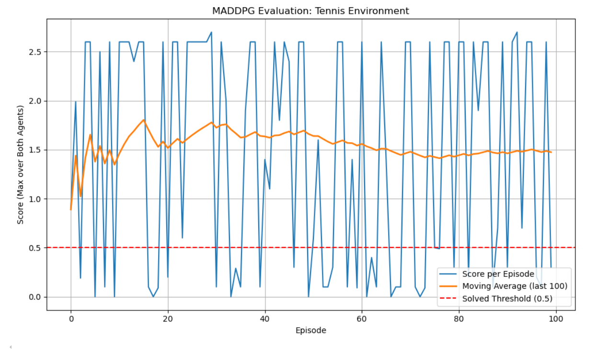

# MADDPG Unity Tennis – Architecture Overview

This document summarizes the overall architecture and module composition of the Multi-Agent Deep Deterministic Policy Gradient (MADDPG) solution applied to the Unity Tennis environment. The goal is a cooperative two-agent scenario where both agents learn to keep the ball in play as long as possible.

---

## 1. Entry Point: `train_maddpg.py`

- **Purpose**: Parses command-line arguments or a JSON config, sets up random seeds and device, instantiates the agent and replay buffer, and kicks off training via the `Trainer` class.  
- **Key Components**:
  - `setup_args()`: Handles CLI and JSON config overrides. 
  - `make_agent_and_buffer()`: Creates a `MADDPGAgent` and a `MultiAgentReplayBuffer`. 
  - `main()`: Builds a timestamped `log_dir`, instantiates `Trainer`, runs `trainer.train()`, and prints the final score.   

---

## 2. Experience Replay: `replay.py`

- **Class**: `MultiAgentReplayBuffer`  
- **Role**: Shared FIFO memory storing transition tuples `(states, actions, rewards, next_states, dones)` for *all* agents at each time step.  
- **Features**:
  - Batches samples of size `batch_size` as stacked tensors per agent.  
  - Uses a fixed seed RNG for reproducibility.  
  - Ensures efficient multi-agent sampling.

---

## 3. Environment Wrapper: `env.py`

- **Class**: `BootstrappedEnvironment`  
- **Role**: Robust UnityEnvironment interface handling:
  - Automatic retries on `reset()` and `step()` failures.  
  - Optional preprocessing of observations via `preprocess_fn`.  
  - Optional reward shaping via `reward_shaping_fn`.  
  - Clean shutdown and OS-level process cleanup (using `pkill`).  

---

## 4. Exploration Noise: `noise.py`

- **Abstract Base**: `Noise` interface defines `reset()` and `sample()`.  
- **Implementations**:
  - `OUNoise`: Ornstein–Uhlenbeck process for temporally correlated noise.  
  - `GaussianNoise`: Independent Gaussian noise per action dimension. (This was used in my training)

---

## 5. Neural Network Modules: `actor_critic.py`

- **`Actor`**:
  - Fully connected NN mapping local observations to actions in \[-1,1\].  
  - Optional LayerNorm for hidden layers.  
- **`Critic`**:
  - Takes *all* agents’ observations and actions (concatenated) to estimate joint Q-value.  
  - Injects actions after first hidden layer.  
  - Optional LayerNorm and dropout. 

---

## 6. Single-Agent DDPG Wrapper: `ddpg_agent.py`

- **Class**: `DDPGAgent`  
- **Responsibilities**:
  - Maintains `actor` and `critic` networks along with their target counterparts.  
  - Implements soft updates (Polyak averaging) of target networks.  
  - Manages exploration noise per agent.  
  - Executes the DDPG learning step:  
    1. Critic update via MSE loss between expected and target Q.  
    2. Actor update via policy gradient (`–Q`).  
    3. Soft updates of target nets.  
  - Provides telemetry metrics for logging.   

---

## 7. MADDPG Coordinator: `maddpg_agent.py`

- **Class**: `MADDPGAgent`  
- **Role**: Orchestrates multiple `DDPGAgent` instances (one per agent):
  - Aggregates per-agent actions and noises.  
  - Flattens and combines observations/actions for joint critic computation.  
  - Implements the multi-agent `step()` to perform one learning update across all agents:
    - Computes next-state joint actions using target actors (with optional smoothing noise).  
    - Calls each agent’s `learn()` with its local batch and the joint batch.  
  - Records per-agent training logs.

---

## 8. Training Loop & Logging: `trainer.py`

- **Class**: `Trainer`  
- **Responsibilities**:
  1. **Data Collection**  
     - Interacts with `BootstrappedEnvironment` to collect `(state, action, reward, next_state, done)` tuples.  
     - Applies selective negative‐reward filtering during early training.  
     - Stores transitions in `MultiAgentReplayBuffer`.  
  2. **Learning**  
     - After warmup, samples batches every `train_every` steps.  
     - Optionally normalizes states via `RunningNormalizer`.  
     - Calls `MADDPGAgent.step()` to update all agents.  
  3. **Logging**  
     - TensorBoard logs for episode rewards, raw vs. shaped rewards, noise statistics, buffer contents, actor/critic losses, Q-values, gradient norms, and normalizer stats.  
  4. **Early Stopping**  
     - Stops training when the 100-episode moving average exceeds a threshold (e.g., 0.6).  
  5. **Offline Mode**  
     - Supports purely offline training from a pre-filled buffer. 

---

## 9. State Normalization Utility: `running_norm.py`

- **Class**: `RunningNormalizer`  
- **Function**: Maintains an exponential moving average of means and variances per observation feature for on-the-fly z-score normalization.  
- **Usage**: Improves training stability by normalizing input states before actor selection and critic updates.   

---

## 10. Codebase Structure

```

.
├── train_maddpg.py                 # CLI entrypoint
├── Tennis.ipynb                 # Jupyter Notebook entrypoint
└── codebase
    ├── experience
    │   └── replay.py               # MultiAgentReplayBuffer
    ├── maddpg
    │   ├── env.py                  # BootstrappedEnvironment
    │   ├── noise.py                # Noise processes
    │   ├── actor_critic.py         # Actor & Critic nets
    │   ├── ddpg_agent.py           # Single-Agent DDPG
    │   ├── maddpg_agent.py         # Multi-Agent coordinator
    │   └── trainer.py              # Training loop & logging
    └── utils
    └── running\_norm.py         # State normalizer (not used - I experimented with it)

```

---

### Data & Control Flow

1. **Initialization**  
   - `train_maddpg.py` parses config → seeds → creates `MADDPGAgent` & `MultiAgentReplayBuffer` → initializes `Trainer`.  
2. **Episode Loop** (`Trainer.train`)  
   - Reset environment → obtain initial observations.  
   - **Time-step Loop**:
     - **Action Selection**:  
       - Before warmup: random/Gaussian actions.  
       - After warmup: `MADDPGAgent.act()` → per-agent `DDPGAgent.actor` + exploration noise.  
     - **Environment Step** → next states, (shaped) rewards, done flags.  
     - **Buffer Storage** → selective negative-reward filtering.  
     - **Learning** (if buffer ready & warmup passed) → sample batch → normalize (optional) → `MADDPGAgent.step()` → per-agent updates.  
   - End of episode: log rewards & moving average; check early stopping.  
3. **Termination**  
   - Close Unity environment; flush TensorBoard logs; return episode score history.  

---

This modular design cleanly separates concerns—environment handling, experience replay, network architectures, per-agent DDPG logic, multi-agent coordination, training orchestration, and logging—ensuring extensibility and maintainability for further experimentation.

## Learning Algorithm and Training Strategy

This solution implements the **Multi-Agent Deep Deterministic Policy Gradient (MADDPG)** algorithm for cooperative training in the Unity Tennis environment. Each agent is modeled using a separate **DDPG** (Deep Deterministic Policy Gradient) learner with an individual actor and critic, but training is **centralized for the critic** and **decentralized for the actor**. That is:

- The **actor** of each agent only sees its own observations.
- The **critic** of each agent takes as input the **observations and actions of all agents**, which enables learning coordinated policies in a multi-agent setting.

The critic is updated using the target Q-value computed from the current agent's **own reward**, ensuring a cooperative training objective.

### Key Training Phases

1. **Warmup Phase** (first `10,000` steps):
   - Agents act **purely randomly** using Gaussian noise (`μ = 0, σ = 0.5`) to fill the buffer with uncorrelated, exploratory experiences.
   - No gradient updates are performed during this phase.

2. **Early Training Phase** (steps 0–20,000):
   - Learning begins at 10000 steps, but only **20% of zero-reward transitions** are kept the first 20000 steps
   - This mechanism **filters out uninformative experiences**, which are very frequent in the early stages of Unity Tennis.

3. **Reward Scaling**:
   - The environment’s default reward signal is extremely sparse and weak (e.g., `+0.1` for successful volley).
   - To amplify learning signals, **positive rewards were scaled by a factor of 100**, resulting in `+10.0` instead of `+0.1`.
   - Negative and zero rewards are left unchanged.

---

## Neural Network Architectures

Each agent uses the following networks:

### Actor Network

| Layer            | Details                        |
|------------------|--------------------------------|
| Input            | Own agent's observation (24-d) |
| Hidden Layer 1   | Linear → ReLU (size: 128)      |
| Hidden Layer 2   | Linear → ReLU (size: 128)      |
| Output           | Linear → Tanh (size: 2)        |

- The output uses `tanh` activation to bound actions to \([-1, +1]\).

### Critic Network

| Layer            | Details                                     |
|------------------|---------------------------------------------|
| Input            | All agents’ observations (48-d)             |
| Hidden Layer 1   | Linear → ReLU (size: 128)                   |
| Action Insertion | Concatenate all agents' actions (4-d) here  |
| Hidden Layer 2   | Linear → ReLU (size: 128)                   |
| Output           | Linear (size: 1)                            |

- The critic is agent-specific but trained on **joint state-action input**, enabling it to evaluate the cooperative team behavior effectively.

---

## Default Hyperparameters

| Parameter                     | Value          |
|-------------------------------|----------------|
| `lr_actor`                    | 1e-3           |
| `lr_critic`                   | 1e-4           |
| `gamma` (discount factor)     | 0.99           |
| `tau` (soft update rate)      | 1e-3           |
| `buffer_size`                 | 1e5            |
| `batch_size`                  | 128            |
| `train_every` (env step)                | 1              |
| `actor_hidden_sizes`         | [128, 128]     |
| `critic_hidden_sizes`        | [128, 128]     |
| `noise_type`                  | Gaussian       |
| `noise_sigma` (early exploration)                | 0.5            |
| `noise_sigma` (learning)                | 0.3            |
| `noise_decay`                 | None (constant)|
| `reward_scale_positive_only` | 100.0          |
| `zero_reward_filter_ratio`   | 0.20           |

Training was stopped after episode **2758** with an ma value of 0.607.

## Reward Plot (Scores)


## Future Ideas for Improving Agent Performance

While the current MADDPG implementation achieves the required cooperative behavior in the Unity Tennis environment, several promising directions could further improve both **learning speed** and **final performance**:

### Efficiency Improvements

- **Reduce Sample Inefficiency**: Current training requires tens of thousands of environment steps. Introducing **prioritized experience replay** could focus learning on more informative transitions.
- **Reward Shaping Refinement**: Instead of fixed reward scaling, a **shaping function** could progressively guide the agent (e.g., time-based curriculum or event-driven bonuses).

### Algorithmic Upgrades

- **Switch to TD3 (Twin Delayed DDPG)**:
  - Uses **twin critics** to reduce overestimation bias.
  - Adds **target policy smoothing** and **delayed actor updates**.
  - More stable in continuous control settings, often outperforming DDPG variants.

- **Explore Soft Actor-Critic (SAC)**:
  - An **off-policy algorithm** optimizing both reward and entropy.
  - Encourages better exploration and is robust across diverse environments.
  - Requires adaptation to multi-agent setups (MASAC or centralized critics).

### Multi-Agent Enhancements

- **Centralized Training with Decentralized Execution (CTDE) Extensions**:
  - Investigate **parameter sharing** between agents to reduce variance and speed up convergence.
  - Test **attention-based critics** that dynamically weigh other agents' contributions.

- **Asynchronous or Parallel Experience Collection**:
  - Use multiple parallel environment instances to speed up buffer filling and stabilize learning with more diverse data.

- **Meta-Learning or Population-Based Training**:
  - Automatically adapt hyperparameters or exploration behavior during training using PBT or meta-gradients.

- **State Normalization Improvements**:
  - Improve the stability of learning by using **adaptive normalization per agent** or **Whitening Transformations**.

---

These directions align the solution more closely with **state-of-the-art continuous control methods** and could be explored in future iterations for more sample-efficient, stable, and scalable learning.
