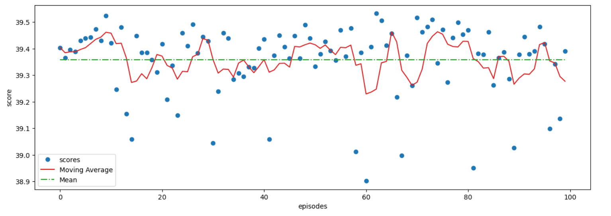

# Report

## Solution Structure

* **Environment Wrapper** (`env.py` / `BootstrappedEnvironment`)
  Handles Unity ML-Agents integration, optional reward shaping, and train vs. eval modes.

* **Agent Implementation** (`agent.py`)

  * `DDPGAgent` encapsulates policy and value networks, OU noise, replay buffer, and learning logic.
  * Exposes `act(...)`, `step(...)`, `learn(...)`, and `soft_update(...)` methods.

* **Replay Buffer** (`replay_buffer.py`)

  * Uniform, without-replacement buffer (fixed in this project).
  * Stores `(state, action, reward, next_state, done)` tuples and samples batches for learning.

* **Network Definitions** (`actor.py`, `critic.py`, or `model.py`)

  * Defines the `Actor` and `Critic` neural nets used by the agent.

* **Training Loop** (either `train_ddpg.py` or in place in `Continuous_Control.ipynb`)

  * Reads a `TrainingConfig`, builds components, runs episodes, logs via TensorBoard, and saves weights.

* **Evaluation Script in Notebook** (`Continuous_Control.ipynb`)

  * Loads saved weights, runs the agent in inference mode for *n* episodes, and collects scores for plotting.

---

## Algorithm

**Deep Deterministic Policy Gradient (DDPG)**

* Off-policy actor-critic method for continuous action spaces.
* **Actor** $\pi(s|\theta^\mu)$ outputs deterministic actions; **Critic** $Q(s,a|\theta^Q)$ evaluates them.
* **Soft updates** of target networks:

  $$
    \theta_{\text{target}} \leftarrow \tau\,\theta_{\text{local}} + (1-\tau)\,\theta_{\text{target}}
  $$
* **Exploration** via Ornstein–Uhlenbeck noise added to actor outputs during training.

---

## Hyperparameters

| Parameter                  |    Value |
| -------------------------- | -------: |
| **Environment**            |          |
| num\_agents                |       20 |
| state\_size                |       33 |
| action\_size               |        4 |
| **Training Schedule**      |          |
| episodes                   |      500 |
| max\_steps per episode     |     1000 |
| batch\_size                |      128 |
| learn\_after               |        0 |
| sampling\_warmup           |        0 |
| **Optimization**           |          |
| lr\_actor                  | 1 × 10⁻⁴ |
| lr\_critic                 | 1 × 10⁻⁴ |
| critic\_weight\_decay      |      0.0 |
| critic\_clipnorm           |     None |
| gamma (discount)           |     0.99 |
| tau (soft-update)          | 1 × 10⁻³ |
| **Exploration (OU noise)** |          |
| use\_ou\_noise             |     True |
| ou\_theta                  |     0.15 |
| ou\_sigma                  |      0.2 |
| noise\_decay               |    False |
| init\_noise                |      1.0 |
| min\_noise                 |     0.05 |
| **Replay Buffer**          |          |
| capacity                   |  100 000 |
| **Zero-reward Filtering**  |          |
| enabled                    |    False |
| prob\_start                |      0.0 |
| prob\_end                  |      0.0 |
| anneal\_steps              |        0 |
| **Evaluation**             |          |
| eval\_freq                 |       10 |
| eval\_episodes             |        1 |
| eval\_threshold            |     30.0 |
| eval\_warmup               |       20 |

> All of the above are defined in the `TrainingConfig` dataclass .

---

## Network Architectures

* **Actor** (`Actor` in `model.py`)&#x20;

  * **Input**: 33-dim state
  * **Hidden layers**:

    * FC1: 256 units → ReLU
    * FC2: 128 units → ReLU
  * **Output**: 4-dim action → Tanh (to $-1,1$)

* **Critic** (`Critic` in `model.py`)&#x20;

  * **Input**:

    * State (33-dim) → FC1 (256) → ReLU
    * Concatenate action (4-dim) → FC2 (128) → ReLU
  * **Output**: 1-dim Q-value

---

## Additional Features
I implemented some additional features, because I had problems in the project. But in the end I tweaked my flexible training with basic parameters and this did the work.

* **Reward Shaping**

  * Integrated `VelocityRewardShaper` to boost velocity‐based rewards, with configurable decay of α, proximity bonuses, etc.

* **Warm-up Phases**

  * `sampling_warmup`: first N steps use random actions to fill buffer.

* **Noise Scheduling / Decay**

  * Support for decaying OU‐noise scale via an exponential schedule.

* **Zero-Reward Filtering**

  * Optional annealed dropping of 0-reward transitions to focus learning on informative experiences.

---

## Results

* **Training**

  * Smooth convergence: environment “solved” (avg. score ≥ 30 over 20 agents) by **episode 32**.

* **Evaluation**

  * Over **100** noise-free evaluation episodes, the **mean score** remained **above 30**, demonstrating a robust policy.

Here is a plot which shows the evaluation of the trained agent across 100 episodes. The scores are stable and consistently in a high score range (38-39) which is more that the minimum requirement of 30.

---

### Future Ideas

To further enhance the agent's performance and scalability, the following improvements are planned:

* **Advanced Features**: Incorporate additional techniques such as reward shaping, decaying storage of zero-reward transitions, and dynamic or static noise decay to improve exploration and learning stability.

* **Upgrade to TD3**: Twin Delayed DDPG (TD3) builds on DDPG by addressing its overestimation bias through the use of two critics (taking the minimum Q-value), delayed policy updates, and target policy smoothing. These modifications often lead to more stable and reliable training in continuous control tasks.

* **Implement Soft Actor-Critic (SAC)**: SAC is an off-policy algorithm that optimizes a stochastic policy using entropy maximization. It is more sample-efficient than DDPG and TD3 and better handles environments with high stochasticity or multiple modes in the action space.

* **Asynchronous and Parallel Training**: To align the project with real-world industrial standards, the architecture could be redesigned using a worker-based system. Separate workers for training, evaluation, and environment interaction would enable asynchronous updates and better utilization of computational resources.

---

Overall, the DDPG agent with the fixed uniform replay buffer, OU-noise exploration, and the optional additional curriculum features successfully solves the 20-agent Unity Reacher environment well within the project requirements.
