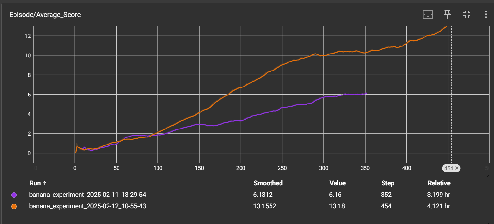

# Project Report: Navigation with Deep Q-Learning

## Learning Algorithm

This project implements a **Deep Q-Network (DQN) with Prioritized Experience Replay (PER)** to train an agent that navigates and collects yellow bananas while avoiding blue ones. The reinforcement learning task is episodic, and the goal is to achieve an average score of at least **+13** over **100 consecutive episodes**.

### Algorithm Details
- **Deep Q-Learning**: The agent uses a neural network to estimate Q-values and selects actions using an **epsilon-greedy policy**.
- **Prioritized Experience Replay (PER)**: Instead of uniform sampling, experiences are sampled based on their **TD-error**, prioritizing more informative samples.
- **Target and Local Networks**: Two neural networks are maintained. The **local network** is updated at each step, while the **target network** is updated periodically using a **soft update mechanism**.
- **Epsilon-Greedy Exploration**: The agent balances exploration and exploitation by decreasing epsilon (`ε`) over time.

### Hyperparameters
- **Replay Buffer Size**: `100,000`
- **Batch Size**: `64`
- **Discount Factor (Gamma, γ)**: `0.99`
- **Soft Update Parameter (Tau, τ)**: `1e-3`
- **Learning Rate (LR)**: `5e-5`
- **Update Frequency**: `Every 4 steps`
- **Prioritization Factor (Alpha, α)**: `0.6`
- **Importance-Sampling Factor (Beta, β)**: `0.4` (annealed over 100,000 steps)

### Annotation to the Beta Sampling Factor
I tried 100000 as a start, I really didn't know how long my agent will take to train. In the end he took 454 episodes to finish training. So the beta value was not optimal, but nevertheless the training was successful. Maybe not with optimal speed, but it did its job.

### Neural Network Architecture
The **Q-Network** is very simple and consists of:
- **Input Layer**: 37-dimensional state representation
- **Hidden Layers**:
  - **Fully Connected (FC) Layer 1**: 128 neurons with **ReLU activation**
  - **Fully Connected (FC) Layer 2**: 128 neurons with **ReLU activation**
- **Output Layer**: 4 neurons (one for each action), producing Q-values for the available actions

```python
class QNetwork(nn.Module):
    def __init__(self, state_size, action_size, seed):
        super(QNetwork, self).__init__()
        self.seed = torch.manual_seed(seed)
        self.fc1 = nn.Linear(state_size, 128)
        self.fc2 = nn.Linear(128, 128)
        self.fc3 = nn.Linear(128, action_size)
    
    def forward(self, state):
        x = F.relu(self.fc1(state))
        x = F.relu(self.fc2(x))
        return self.fc3(x)
```

---

## Plot of Rewards

The following plot shows the **reward per episode** during training. The agent successfully achieved an average score of **at least +13** over **100 consecutive episodes**, solving the environment.



I've also added the log directory for my SummaryWriter. There all metrics recorded can be found for analyzation.

---

## Ideas for Future Work

To improve the agent's performance, the following enhancements can be considered:

### 1. **Dueling DQN**
- Separates Q-values into **state-value (V)** and **advantage (A)** components.
- Helps the network better differentiate important states from less important ones.

### 2. **Double DQN (DDQN)**
- Uses the local network to select actions and the target network to evaluate them.
- Reduces **Q-value overestimation**, leading to better learning.

### 3. **Noisy Networks for Exploration**
- Instead of manually decreasing epsilon (`ε`), uses a **noisy layer** to add randomness to action selection.
- Enables **adaptive exploration** without requiring `ε` tuning.

### 4. **Adaptive Learning Rate**
- Instead of a fixed **learning rate (5e-5)**, implement a **learning rate scheduler**.
- Allows the model to learn faster at the beginning and stabilize later in training.

These future enhancements could lead to faster convergence, better generalization, and higher final scores in this navigation task.
